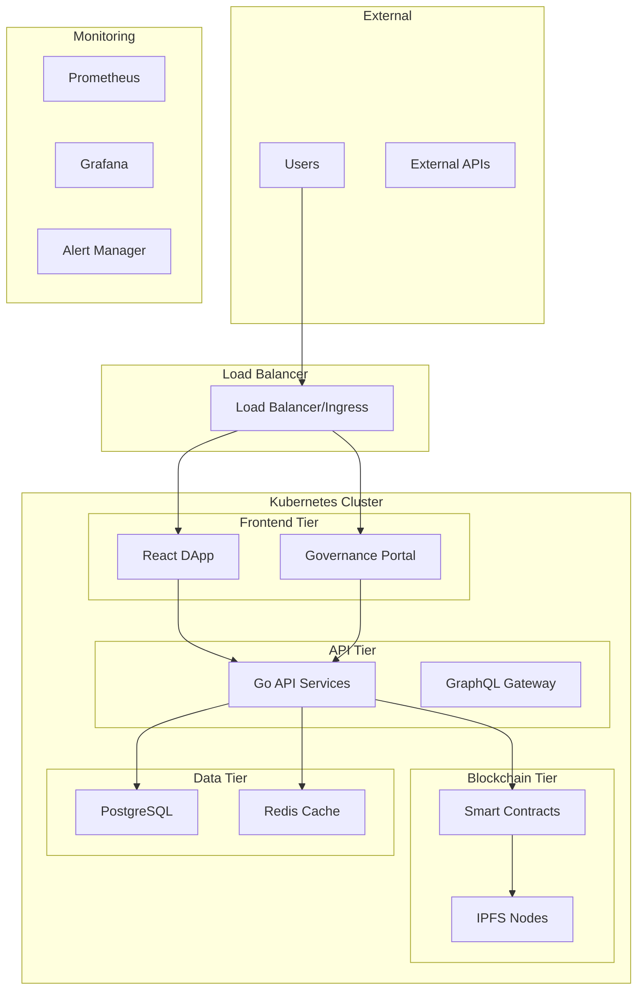

# Deployment and DevOps Documentation

This directory contains comprehensive deployment and DevOps documentation for the iServe Protocol, following enterprise deployment standards with Docker containerization and Kubernetes orchestration.

## 📋 Contents

### Container Deployment
- **[Docker Guide](DOCKER_GUIDE.md)** - Complete Docker containerization guide
- **[Docker Compose](DOCKER_COMPOSE.md)** - Multi-service local development setup

### Kubernetes Deployment
- **[Kubernetes Setup](KUBERNETES_SETUP.md)** - Production Kubernetes deployment
- **[Helm Charts](HELM_CHARTS.md)** - Helm-based deployment management
- **[Service Mesh](SERVICE_MESH.md)** - Istio/Linkerd service mesh integration

### CI/CD Pipeline
- **[CI/CD Pipeline](CI_CD_PIPELINE.md)** - Automated testing and deployment
- **[GitHub Actions](GITHUB_ACTIONS.md)** - GitHub Actions workflows
- **[Deployment Strategies](DEPLOYMENT_STRATEGIES.md)** - Blue-green, canary deployments

### Monitoring and Operations
- **[Monitoring Setup](MONITORING.md)** - Prometheus, Grafana, alerting
- **[Logging](LOGGING.md)** - Centralized logging with ELK stack
- **[Health Checks](HEALTH_CHECKS.md)** - Application health monitoring

### Security and Compliance
- **[Security Hardening](SECURITY_HARDENING.md)** - Container and cluster security
- **[Compliance](COMPLIANCE.md)** - SOC2, ISO27001 compliance guides
- **[Secrets Management](SECRETS_MANAGEMENT.md)** - Vault, sealed secrets

### Environment Management
- **[Environment Configuration](ENVIRONMENT_CONFIG.md)** - Dev, staging, production configs
- **[Infrastructure as Code](INFRASTRUCTURE_AS_CODE.md)** - Terraform, Pulumi
- **[Backup and Recovery](BACKUP_RECOVERY.md)** - Data backup and disaster recovery

## 🚀 Quick Start

1. **Development**: Start with [Docker Guide](DOCKER_GUIDE.md)
2. **Production**: Follow [Kubernetes Setup](KUBERNETES_SETUP.md)
3. **CI/CD**: Configure [CI/CD Pipeline](CI_CD_PIPELINE.md)
4. **Monitoring**: Set up [Monitoring](MONITORING.md)

## 🏗️ Architecture Overview

The iServe Protocol deployment architecture follows cloud-native principles:

## 🔧 Technology Stack

### Container Runtime
- **Container Engine**: Docker/containerd
- **Registry**: Harbor/ECR/GCR
- **Security**: Trivy scanning, distroless images

### Orchestration
- **Platform**: Kubernetes 1.24+
- **Ingress**: NGINX/Traefik/Istio Gateway
- **Service Mesh**: Istio/Linkerd (optional)

### CI/CD
- **Git**: GitHub/GitLab
- **Pipeline**: GitHub Actions/GitLab CI
- **Deployment**: ArgoCD/Flux
- **Testing**: Automated unit, integration, e2e tests

### Monitoring Stack
- **Metrics**: Prometheus + Grafana
- **Logging**: ELK/EFK Stack
- **Tracing**: Jaeger/Zipkin
- **Alerting**: AlertManager + PagerDuty/Slack

### Security
- **Secrets**: Kubernetes Secrets/Vault
- **Network**: Network Policies/Service Mesh
- **Scanning**: Trivy/Snyk/Clair
- **Compliance**: OPA Gatekeeper

## 📊 Deployment Environments

### Development
- **Purpose**: Local development and testing
- **Infrastructure**: Docker Compose or minikube
- **Data**: Test data, mock services
- **Access**: Developer workstations only

### Staging
- **Purpose**: Integration testing and QA
- **Infrastructure**: Kubernetes cluster (smaller)
- **Data**: Anonymized production-like data
- **Access**: Development team and QA

### Production
- **Purpose**: Live user traffic
- **Infrastructure**: Multi-zone Kubernetes cluster
- **Data**: Real user data with backups
- **Access**: Limited to operations team

## 🚨 Emergency Procedures

### Incident Response
1. **Detection**: Automated alerts or manual reports
2. **Assessment**: Determine severity and impact
3. **Response**: Execute runbooks and escalate
4. **Communication**: Notify stakeholders
5. **Resolution**: Fix issue and verify
6. **Post-mortem**: Document lessons learned

### Disaster Recovery
1. **Backup Verification**: Ensure backups are current
2. **Failover**: Switch to backup systems
3. **Data Recovery**: Restore from backups
4. **Service Restoration**: Bring services online
5. **Monitoring**: Verify full functionality

## 📝 Best Practices

### Container Security
- Use minimal base images (distroless/alpine)
- Regular security scanning
- Non-root container execution
- Resource limits and quotas

### Kubernetes Security
- Network policies for micro-segmentation
- RBAC for access control
- Pod Security Standards
- Regular cluster updates

### Deployment Safety
- Automated testing at all stages
- Gradual rollout strategies
- Rollback capabilities
- Health checks and monitoring

---

*This documentation follows enterprise deployment standards and is maintained by the DevOps team.*