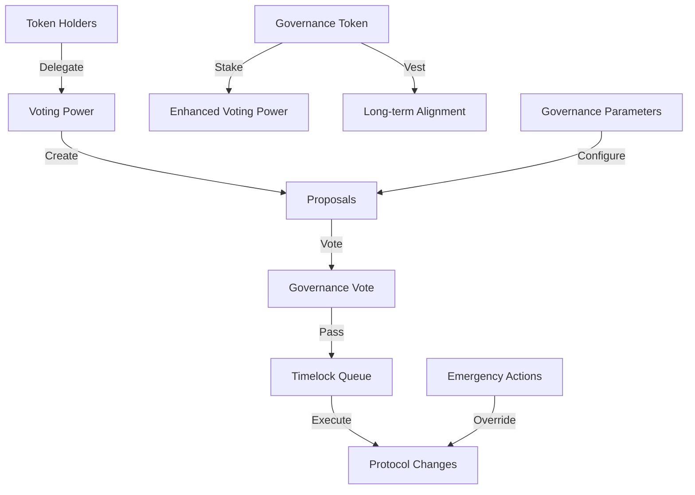
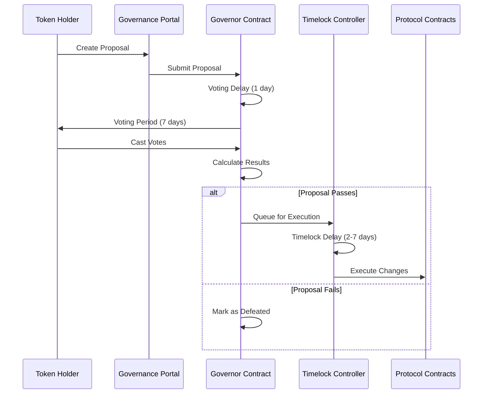

# iServe Protocol Governance Overview

## Table of Contents
1. [Introduction](#introduction)
2. [Governance Architecture](#governance-architecture)
3. [Governance Token ($ISERVE-GOV)](#governance-token-iserve-gov)
4. [Governance Process](#governance-process)
5. [Proposal Types](#proposal-types)
6. [Voting Mechanisms](#voting-mechanisms)
7. [Governance Parameters](#governance-parameters)
8. [Security Features](#security-features)
9. [Getting Started](#getting-started)

## Introduction

The iServe Protocol implements a comprehensive on-chain governance system that enables token holders to participate in protocol decision-making. The governance system is designed to be secure, transparent, and inclusive while maintaining the protocol's integrity and long-term sustainability.

### Key Principles
- **Decentralization**: Decision-making power distributed among token holders
- **Transparency**: All proposals and votes are publicly recorded on-chain
- **Security**: Multi-layered security features including timelock delays
- **Inclusivity**: Multiple ways to participate in governance
- **Adaptability**: Governance parameters can be updated through governance

## Governance Architecture

The iServe governance system consists of several interconnected components:



### Core Components

1. **IServeGovToken**: ERC-20 governance token with voting capabilities
2. **IServeGovernance**: OpenZeppelin Governor contract for proposal management
3. **IServeTimelock**: Timelock controller for execution delays
4. **GovernanceIntegration**: Protocol-specific governance features
5. **GovernanceParameters**: Configurable governance parameters

## Governance Token ($ISERVE-GOV)

### Token Distribution
- **Total Supply**: 1,000,000,000 $ISERVE-GOV
- **Ecosystem & Community**: 40% (400M tokens)
- **Core Contributors**: 20% (200M tokens)
- **Treasury**: 15% (150M tokens)
- **Investors**: 15% (150M tokens)
- **Public Sale & Liquidity**: 10% (100M tokens)

### Token Features
- **Voting Rights**: 1 token = 1 vote (with delegation)
- **Staking Rewards**: Earn rewards for staking tokens
- **Vesting**: Time-locked distribution for contributors and investors
- **Delegation**: Transfer voting power to trusted representatives
- **Permit**: Gasless approvals using EIP-2612

### Staking Benefits
- **Enhanced Voting Power**: Staked tokens may receive voting multipliers
- **Governance Rewards**: Earn additional tokens for active participation
- **Long-term Alignment**: Encourages long-term protocol commitment

## Governance Process

### Proposal Lifecycle



### Phase Details

1. **Proposal Creation** (Immediate)
   - Proposer must hold minimum threshold (10M tokens)
   - Proposal includes targets, values, and execution data
   - Community discussion begins

2. **Voting Delay** (~1 day)
   - Buffer period before voting begins
   - Allows for final review and discussion
   - Prevents last-minute proposal attacks

3. **Voting Period** (~7 days)
   - Token holders cast votes: For, Against, or Abstain
   - Delegation allows non-active users to participate
   - Real-time vote tracking available

4. **Execution** (2-7 days after passing)
   - Successful proposals enter timelock queue
   - Community can review and prepare for changes
   - Automatic execution after timelock period

## Proposal Types

### 1. Parameter Updates
**Purpose**: Modify governance or protocol parameters
**Examples**:
- Adjust voting periods or proposal thresholds
- Update protocol fees or limits
- Modify staking rewards or parameters

**Requirements**:
- Detailed explanation of changes
- Impact analysis on protocol
- Recommended voting period: Standard (7 days)

### 2. Treasury Management
**Purpose**: Manage protocol treasury funds
**Examples**:
- Allocate funds for development
- Approve grants or partnerships
- Invest treasury assets

**Requirements**:
- Financial impact assessment
- Multi-signature requirements for large amounts
- Extended discussion period recommended

### 3. Protocol Upgrades
**Purpose**: Upgrade smart contracts or add new features
**Examples**:
- Deploy new contract versions
- Add new credential types
- Integrate with other protocols

**Requirements**:
- Technical specification document
- Security audit report
- Comprehensive testing evidence
- Extended timelock period (7+ days)

### 4. Emergency Actions
**Purpose**: Address critical security issues
**Examples**:
- Pause protocol in case of exploit
- Emergency parameter changes
- Security incident response

**Requirements**:
- Emergency multisig approval
- Shortened timelock for critical issues
- Post-incident governance ratification

### 5. Governance Meta-Changes
**Purpose**: Modify governance system itself
**Examples**:
- Update governance contracts
- Change voting mechanisms
- Modify governance parameters

**Requirements**:
- Super-majority threshold (60%+)
- Extended discussion period
- Multiple governance cycles for major changes

## Voting Mechanisms

### Standard Voting
- **For**: Support the proposal
- **Against**: Oppose the proposal  
- **Abstain**: Participate without taking a position

### Voting Power Calculation
```
Voting Power = Token Balance + Delegated Tokens + Staking Multiplier
```

### Delegation
Token holders can delegate their voting power to:
- **Self-delegation**: Vote with own tokens
- **Representative delegation**: Delegate to trusted community members
- **Pool delegation**: Delegate to governance pools or DAOs

### Quorum Requirements
- **Standard Proposals**: 4% of total supply
- **Parameter Changes**: 4% of total supply
- **Emergency Actions**: 2% of total supply (expedited)
- **Meta-governance**: 7% of total supply

## Governance Parameters

### Current Configuration

| Parameter | Value | Description |
|-----------|-------|-------------|
| Proposal Threshold | 10M tokens (1%) | Minimum tokens to create proposal |
| Quorum Percentage | 4% | Minimum participation for valid vote |
| Voting Delay | 6,570 blocks (~1 day) | Delay before voting starts |
| Voting Period | 46,024 blocks (~7 days) | Duration of voting period |
| Timelock Delay | 172,800 seconds (2 days) | Delay before execution |
| Max Actions | 10 | Maximum actions per proposal |
| Grace Period | 1,209,600 seconds (14 days) | Window for execution after timelock |

### Parameter Bounds

All parameters have safety bounds to prevent governance attacks:

- **Proposal Threshold**: 1 token - 100M tokens
- **Quorum**: 1% - 20% of total supply
- **Voting Delay**: 1 block - 2 weeks
- **Voting Period**: 1 day - 50 days
- **Timelock Delay**: 1 hour - 30 days

## Security Features

### Timelock Protection
- **Standard Delay**: 2 days for most proposals
- **Extended Delay**: 7 days for critical changes
- **Grace Period**: 14 days to execute after timelock
- **Cancellation**: Governance can cancel queued proposals

### Multi-layered Security
1. **Proposal Validation**: Automatic checks for valid parameters
2. **Voting Period**: Sufficient time for community review
3. **Timelock Delay**: Buffer for community reaction
4. **Emergency Pause**: Immediate pause for security incidents
5. **Parameter Bounds**: Prevents dangerous parameter changes

### Attack Prevention
- **Flash Loan Protection**: Votes based on historical token balances
- **Delegation Limits**: Reasonable limits on delegation concentration
- **Proposal Spam Protection**: Minimum threshold and delays
- **Front-running Protection**: Commit-reveal voting (future upgrade)

## Getting Started

### For Token Holders

1. **Acquire Tokens**: Obtain $ISERVE-GOV through approved exchanges
2. **Delegate Voting Power**: Self-delegate or choose a representative
3. **Stay Informed**: Follow governance forums and discussions
4. **Participate**: Vote on proposals that interest you

### For Proposal Creators

1. **Meet Threshold**: Ensure you have 10M+ tokens
2. **Draft Proposal**: Use standard proposal templates
3. **Community Discussion**: Engage with community beforehand
4. **Submit Proposal**: Use governance portal or smart contract
5. **Campaign**: Advocate for your proposal during voting

### For Delegates

1. **Build Reputation**: Demonstrate expertise and engagement
2. **Communicate Platform**: Share your governance philosophy
3. **Stay Active**: Vote on proposals consistently
4. **Report Back**: Keep delegators informed of your decisions

### Resources

- **Governance Portal**: [governance.iserveprotocol.com](https://governance.iserveprotocol.com)
- **Forum**: [forum.iserveprotocol.com](https://forum.iserveprotocol.com)
- **Documentation**: [docs.iserveprotocol.com](https://docs.iserveprotocol.com)
- **Discord**: [discord.gg/iserve](https://discord.gg/iserve)
- **Telegram**: [t.me/iserveprotocol](https://t.me/iserveprotocol)

---

*This document is maintained by the iServe Protocol community. For questions or suggestions, please visit our governance forum.*