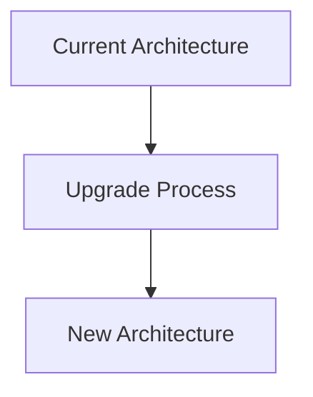

# Proposal Templates

This document provides standardized templates for different types of governance proposals in the iServe Protocol.

## Table of Contents
1. [Parameter Change Proposal](#parameter-change-proposal)
2. [Treasury Allocation Proposal](#treasury-allocation-proposal)
3. [Protocol Upgrade Proposal](#protocol-upgrade-proposal)
4. [Emergency Action Proposal](#emergency-action-proposal)
5. [Grant Proposal](#grant-proposal)
6. [Partnership Proposal](#partnership-proposal)

---

## Parameter Change Proposal

### Template: IIP-XXX: [Parameter Name] Adjustment

#### Summary
Brief 1-2 sentence description of the parameter change.

#### Motivation
- **Current State**: Describe current parameter value and its effects
- **Problem Statement**: Explain why the change is needed
- **Expected Outcome**: What improvement this change will bring

#### Specification

**Parameter Details**:
- **Parameter Name**: [parameter_name]
- **Current Value**: [current_value]
- **Proposed Value**: [new_value]
- **Change Percentage**: [percentage_change]

**Impact Analysis**:
- **User Impact**: How this affects token holders and users
- **Protocol Impact**: How this affects protocol operations
- **Economic Impact**: Financial implications of the change

#### Implementation

**Technical Implementation**:
```solidity
// Smart contract function call
governanceParameters.updateParameter("parameter_name", new_value);
```

**Timeline**:
- **Proposal Submission**: [Date]
- **Voting Period**: [Date] to [Date]
- **Implementation**: [Date] (if approved)

#### Risks and Considerations

**Potential Risks**:
- Risk 1: [Description and mitigation]
- Risk 2: [Description and mitigation]

**Alternative Approaches**:
- Alternative 1: [Description and trade-offs]
- Alternative 2: [Description and trade-offs]

#### Success Metrics
- Metric 1: [How to measure success]
- Metric 2: [Timeline for evaluation]

---

## Treasury Allocation Proposal

### Template: IIP-XXX: Treasury Allocation for [Purpose]

#### Summary
Brief description of the treasury allocation request.

#### Motivation
- **Purpose**: Why these funds are needed
- **Strategic Alignment**: How this aligns with protocol goals
- **Urgency**: Timeline requirements and urgency level

#### Specification

**Allocation Details**:
- **Total Amount**: [amount] $ISERVE-GOV tokens
- **USD Equivalent**: ~$[amount] (at current market price)
- **Allocation Category**: [Development/Ecosystem/Operations/Strategic]
- **Duration**: [timeframe for fund utilization]

**Fund Distribution**:
1. **Phase 1** ([amount]): [specific use case]
2. **Phase 2** ([amount]): [specific use case]
3. **Phase 3** ([amount]): [specific use case]

**Recipient Details**:
- **Recipient**: [individual/organization/multisig]
- **Track Record**: [previous experience and achievements]
- **Qualifications**: [relevant expertise]

#### Implementation

**Execution Plan**:
1. **Approval**: Governance vote approval
2. **Fund Transfer**: Transfer to designated recipient
3. **Milestone Tracking**: Regular progress updates
4. **Reporting**: Monthly/quarterly reports to community

**Smart Contract Execution**:
```solidity
// Treasury transfer function
treasury.transfer(recipientAddress, amount, "Purpose description");
```

#### Accountability and Reporting

**Milestone Schedule**:
- **Month 1**: [specific deliverables]
- **Month 2**: [specific deliverables]
- **Month 3**: [specific deliverables]

**Reporting Requirements**:
- **Frequency**: [weekly/monthly/quarterly]
- **Format**: [written reports/community calls/dashboard]
- **Metrics**: [specific KPIs to track]

**Clawback Conditions**:
- Failure to meet milestones
- Misuse of funds
- Material breach of agreement

#### Budget Breakdown

| Category | Amount | Percentage | Description |
|----------|--------|------------|-------------|
| Development | [amount] | [%] | [description] |
| Marketing | [amount] | [%] | [description] |
| Operations | [amount] | [%] | [description] |
| Contingency | [amount] | [%] | [description] |
| **Total** | **[total]** | **100%** | |

---

## Protocol Upgrade Proposal

### Template: IIP-XXX: [Upgrade Name] Protocol Upgrade

#### Summary
High-level overview of the protocol upgrade.

#### Motivation
- **Current Limitations**: What problems the upgrade solves
- **New Features**: What capabilities will be added
- **User Benefits**: How users benefit from the upgrade

#### Specification

**Technical Changes**:
- **New Contracts**: List of new smart contracts
- **Modified Contracts**: List of contracts being upgraded
- **Deprecated Features**: Features being removed or deprecated

**Architecture Changes**:


**New Features**:
1. **Feature 1**: [Detailed description]
2. **Feature 2**: [Detailed description]
3. **Feature 3**: [Detailed description]

#### Implementation

**Pre-deployment Requirements**:
- [ ] Code development completed
- [ ] Comprehensive testing (>95% coverage)
- [ ] Security audit by [auditor name]
- [ ] Gas optimization analysis
- [ ] Documentation updates

**Deployment Plan**:
1. **Testnet Deployment**: [Date]
2. **Community Testing**: [Date range]
3. **Mainnet Deployment**: [Date]
4. **Migration Process**: [Date range]

**Smart Contract Addresses**:
- **New Contract 1**: [address after deployment]
- **New Contract 2**: [address after deployment]

#### Security Considerations

**Audit Information**:
- **Auditor**: [Audit firm name]
- **Audit Date**: [Date completed]
- **Audit Report**: [Link to full report]
- **Issues Found**: [Number and severity]
- **Issues Resolved**: [Resolution status]

**Security Features**:
- **Access Controls**: [Description of permissions]
- **Upgrade Mechanisms**: [How future upgrades work]
- **Emergency Controls**: [Emergency pause/admin functions]

#### Migration Process

**User Actions Required**:
- [ ] **Token Holders**: [Any required actions]
- [ ] **Credential Holders**: [Migration steps if needed]
- [ ] **Integrators**: [Updates needed for integrations]

**Backward Compatibility**:
- **API Changes**: [Breaking changes and migration guide]
- **Contract Interfaces**: [Interface compatibility]
- **Frontend Updates**: [Required UI updates]

#### Testing and Validation

**Test Coverage**:
- **Unit Tests**: [percentage]% coverage
- **Integration Tests**: [number] test scenarios
- **End-to-End Tests**: [number] complete workflows

**Testnet Results**:
- **Duration**: [testing period]
- **Participants**: [number] community testers
- **Issues Found**: [number and status]
- **Performance Metrics**: [gas usage, response times]

---

## Emergency Action Proposal

### Template: IIP-XXX: Emergency Action - [Issue Description]

#### URGENT: Emergency Situation

**Alert Level**: 🔴 CRITICAL / 🟡 HIGH / 🟢 MEDIUM

#### Immediate Situation

**Issue Description**:
[Clear, concise description of the emergency]

**Discovery**:
- **Discovered By**: [person/team/automated system]
- **Discovery Time**: [exact timestamp]
- **Initial Assessment**: [immediate impact evaluation]

**Affected Systems**:
- [ ] Governance contracts
- [ ] Credential contracts
- [ ] Token contracts
- [ ] Other: [specify]

#### Immediate Actions Taken

**Emergency Response** (completed):
1. **Action 1**: [what was done, by whom, when]
2. **Action 2**: [what was done, by whom, when]
3. **Action 3**: [what was done, by whom, when]

**Current Status**:
- **System State**: [operational/degraded/paused]
- **Asset Security**: [secure/at risk/compromised]
- **User Impact**: [description of user effects]

#### Proposed Emergency Measures

**Immediate Actions Needed**:
1. **Action 1**: [description, urgency, risk if not taken]
2. **Action 2**: [description, urgency, risk if not taken]

**Smart Contract Calls**:
```solidity
// Emergency action 1
emergencyPause();

// Emergency action 2
updateEmergencyParameter("param_name", safe_value);
```

#### Technical Analysis

**Root Cause**:
[Detailed technical explanation of what went wrong]

**Attack Vector** (if applicable):
[How the exploit/issue occurred]

**Fix Strategy**:
[Technical approach to resolve the issue]

#### Risk Assessment

**If No Action Taken**:
- **Financial Risk**: [potential losses]
- **Operational Risk**: [protocol functionality impact]
- **Reputation Risk**: [community trust impact]

**If Action Taken**:
- **Mitigation**: [how risks are reduced]
- **Side Effects**: [any negative consequences]
- **Recovery Time**: [expected resolution timeline]

#### Long-term Resolution

**Permanent Fix**:
[Description of the long-term solution]

**Prevention Measures**:
[How to prevent similar issues in the future]

**Follow-up Actions**:
1. [Action item 1]
2. [Action item 2]
3. [Action item 3]

---

## Grant Proposal

### Template: IIP-XXX: Grant Request - [Project Name]

#### Project Overview

**Project Name**: [Project Name]
**Requested Amount**: [amount] $ISERVE-GOV tokens
**Project Duration**: [timeframe]
**Category**: [Integration/Research/Community/Other]

#### Team Information

**Team Lead**: [Name and background]
**Team Members**:
- **Member 1**: [Name, role, relevant experience]
- **Member 2**: [Name, role, relevant experience]

**Track Record**:
- Previous projects in crypto/blockchain
- Relevant experience with similar protocols
- Community contributions

#### Project Description

**Problem Statement**:
[What problem does this project solve for the iServe ecosystem?]

**Solution Overview**:
[High-level description of the proposed solution]

**Value Proposition**:
[Why is this valuable for the iServe Protocol and community?]

#### Technical Specification

**Architecture**:
[Technical architecture diagram and description]

**Integration Points**:
- **iServe Protocol**: [How it integrates with iServe]
- **External Systems**: [Other systems/protocols involved]
- **APIs**: [New APIs or endpoints created]

**Technology Stack**:
- **Frontend**: [technologies used]
- **Backend**: [technologies used]
- **Blockchain**: [networks and contracts]

#### Development Plan

**Milestones**:

**Milestone 1** ([timeframe]): [deliverables]
- [ ] Deliverable 1
- [ ] Deliverable 2
- **Funding**: [amount]

**Milestone 2** ([timeframe]): [deliverables]
- [ ] Deliverable 1
- [ ] Deliverable 2
- **Funding**: [amount]

**Milestone 3** ([timeframe]): [deliverables]
- [ ] Deliverable 1
- [ ] Deliverable 2
- **Funding**: [amount]

#### Budget Breakdown

| Category | Amount | Percentage | Justification |
|----------|--------|------------|---------------|
| Development | [amount] | [%] | [explanation] |
| Design/UX | [amount] | [%] | [explanation] |
| Testing/QA | [amount] | [%] | [explanation] |
| Documentation | [amount] | [%] | [explanation] |
| Contingency | [amount] | [%] | [explanation] |
| **Total** | **[total]** | **100%** | |

#### Success Metrics

**Quantitative Metrics**:
- Metric 1: [specific, measurable goal]
- Metric 2: [specific, measurable goal]
- Metric 3: [specific, measurable goal]

**Qualitative Metrics**:
- User feedback and adoption
- Community engagement
- Integration quality

#### Risks and Mitigation

**Technical Risks**:
- Risk 1: [description and mitigation strategy]
- Risk 2: [description and mitigation strategy]

**Market Risks**:
- Risk 1: [description and mitigation strategy]
- Risk 2: [description and mitigation strategy]

#### Post-Completion

**Maintenance Plan**:
[How the project will be maintained after completion]

**Open Source Commitment**:
[Licensing and open source contribution plans]

**Community Integration**:
[How the project becomes part of the iServe ecosystem]

---

## Partnership Proposal

### Template: IIP-XXX: Strategic Partnership with [Partner Name]

#### Partnership Overview

**Partner**: [Partner organization name]
**Partnership Type**: [Strategic/Technical/Marketing/Financial]
**Duration**: [timeframe or ongoing]
**Total Value**: [financial commitment if any]

#### Partner Background

**Organization Details**:
- **Founded**: [year]
- **Size**: [employees/users/revenue]
- **Focus**: [primary business/technology focus]
- **Reputation**: [standing in the industry]

**Relevant Experience**:
- Previous partnerships
- Technical capabilities
- Market presence
- Community size

#### Partnership Rationale

**Strategic Alignment**:
[How this partnership aligns with iServe Protocol goals]

**Mutual Benefits**:
- **Benefits to iServe**: [specific advantages]
- **Benefits to Partner**: [what they gain]

**Market Opportunity**:
[Market size and opportunity this partnership opens]

#### Partnership Structure

**Collaboration Areas**:
1. **Technical Integration**: [description]
2. **Marketing/Community**: [description]
3. **Product Development**: [description]
4. **Business Development**: [description]

**Resource Commitments**:
- **iServe Commitments**: [what iServe provides]
- **Partner Commitments**: [what partner provides]

**Financial Terms**:
- **iServe Investment**: [if any]
- **Revenue Sharing**: [if applicable]
- **Cost Sharing**: [shared expenses]

#### Implementation Plan

**Phase 1** ([timeframe]): [objectives]
- [ ] Milestone 1
- [ ] Milestone 2
- [ ] Milestone 3

**Phase 2** ([timeframe]): [objectives]
- [ ] Milestone 1
- [ ] Milestone 2
- [ ] Milestone 3

**Phase 3** ([timeframe]): [objectives]
- [ ] Milestone 1
- [ ] Milestone 2
- [ ] Milestone 3

#### Governance and Oversight

**Partnership Governance**:
- **Decision Making**: [how joint decisions are made]
- **Dispute Resolution**: [process for resolving conflicts]
- **Performance Review**: [regular review process]

**iServe Oversight**:
- **Responsible Team**: [who manages this partnership]
- **Reporting**: [how progress is reported to community]
- **Community Input**: [how community provides feedback]

#### Risk Assessment

**Partnership Risks**:
- **Technical Risk**: [integration or technical challenges]
- **Market Risk**: [market conditions affecting partnership]
- **Execution Risk**: [ability to deliver on commitments]
- **Reputation Risk**: [potential negative impacts]

**Mitigation Strategies**:
- Risk 1: [mitigation approach]
- Risk 2: [mitigation approach]
- Risk 3: [mitigation approach]

#### Success Metrics

**Short-term Goals** (3 months):
- Goal 1: [specific, measurable]
- Goal 2: [specific, measurable]

**Medium-term Goals** (6-12 months):
- Goal 1: [specific, measurable]
- Goal 2: [specific, measurable]

**Long-term Goals** (1+ years):
- Goal 1: [specific, measurable]
- Goal 2: [specific, measurable]

#### Exit Conditions

**Partnership Termination**:
- **Conditions**: [circumstances that would end partnership]
- **Process**: [how termination would be handled]
- **Asset Protection**: [how iServe assets are protected]

---

*These templates should be customized for each specific proposal. For questions about using these templates, please visit the governance forum.*